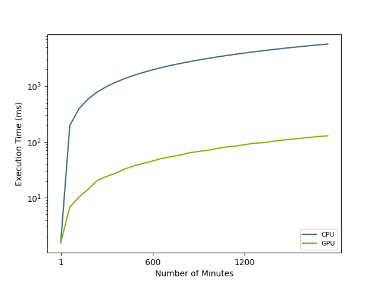

# CUDA integration with PostgreSQL

This project is a example of a CUDA integration with PostgreSQL. It is a simple example of a CUDA kernel that is executed on the GPU and the result is return as a set returning function (SRF). This project also includes an implementation of a CUDA kernel that computes the heart rate of a resident based on their bed sensor data.
## Prerequisites

- Having a valid installation of [PostgreSQL](https://www.postgresql.org/download/) (version 10 or higher)
- Development libraries and headers for C language backend for PostgreSQL
  - `sudo apt install postgresql-server-dev-XX` where `XX` is the version of PostgreSQL
- [CUDA Toolkit](https://docs.nvidia.com/cuda/cuda-installation-guide-linux/) (version 10.1 or higher)
## Repository Installation

```bash
git clone https://github.com/MU-HPDI/postgres-extensions-with-cuda.git
cd postgres-extensions-with-cuda
```
## Usage

1. Make sure that the PostgreSQL server is running.
2. Check valid GPU devices: `nvidia-smi`
Example output:
```
+-----------------------------------------------------------------------------+
| NVIDIA-SMI 470.161.03   Driver Version: 470.161.03   CUDA Version: 11.4     |
|-------------------------------+----------------------+----------------------+
| GPU  Name        Persistence-M| Bus-Id        Disp.A | Volatile Uncorr. ECC |
| Fan  Temp  Perf  Pwr:Usage/Cap|         Memory-Usage | GPU-Util  Compute M. |
|                               |                      |               MIG M. |
|===============================+======================+======================|
|   0  NVIDIA GeForce ...  Off  | 00000000:0A:00.0 Off |                  N/A |
|  0%   37C    P8     2W / 225W |    159MiB /  7981MiB |      0%      Default |
|                               |                      |                  N/A |
+-------------------------------+----------------------+----------------------+
                                                                               
+-----------------------------------------------------------------------------+
| Processes:                                                                  |
|  GPU   GI   CI        PID   Type   Process name                  GPU Memory |
|        ID   ID                                                   Usage      |
|=============================================================================|
|    0   N/A  N/A      1229      G   /usr/lib/xorg/Xorg                 36MiB |
|    0   N/A  N/A      1475      G   /usr/bin/gnome-shell                9MiB |
|    0   N/A  N/A    159183      C   ...ied 127.0.0.1(60178) idle      109MiB |
+-----------------------------------------------------------------------------+
```
3. Check the include PostgreSQL directory: `pg_config --includedir-server`
4. Create a build directory: `mkdir build`
5. Set the required environment variables in a `.env` file from the `.env.example` file.
6. Insert dummy data into the database: `make insert`
7. Run the project: `make clean extension`
## PostgreSQL Functions

Once the project is running, you can execute the following functions:

This function returns the sum of two integer vectors.
```sql
SELECT vector_addition_cuda(ARRAY[1, 2, 3, 4, 5, 6, 7, 8, 9, 10], ARRAY[1, 2, 3, 4, 5, 6, 7, 8, 9, 10]);
```

This function returns the maximum number of each time interval using a parallel reduction algorithm on the GPU.
```sql
SELECT * FROM max_reduction_cuda('2023-04-08 22:00:00'::TIMESTAMP, '2023-04-09 22:00:00'::TIMESTAMP);
```

This function returns the heart rate of a resident based on their bed sensor data.
```sql
SELECT * FROM heart_rate_estimation('bed_data', '2021-05-29 00:00:00'::TIMESTAMP, '2021-06-07 00:00:00'::TIMESTAMP, 100, 'GPU', '1.0');
```
## Environment Variables

The following environment variables are required to run the project:

- `PGUSER`: The PostgreSQL username
- `PGPASSWORD`: The PostgreSQL password
- `PGHOST`: The PostgreSQL server host name
- `PGPORT`: The PostgreSQL server port number
- `PGDATABASE`: The PostgreSQL database name

## Reproducibility

The following steps can be used to reproduce the results of this project (i.e. Fig. 5 from the paper). In this step, we are going to get the heart rate estimation over different time intervals using the GPU and CPU (1 to 1800 minutes of bed sensor data). The experiemnt can take a minute to run and generate the plot. The following steps assume that the project has been installed and all data has been inserted into the database. (See the [Repository Installation](#repository-installation) and [Usage](#usage) sections for more details.):

1. Run the following command:
```bash
make plot
```
2. The plot will be saved in the `scripts` directory. 

**Note:** If the plot is already generated, you need to change the `experiment_version` variable in the `scripts/plots.py` file to perform a new experiment.
## License

This project is licensed under the MIT License. See the `LICENSE` file for details.

## Acknowledgements

- [PostgreSQL](https://www.postgresql.org/)
- [CUDA Toolkit](https://developer.nvidia.com/cuda-toolkit)

Please feel free to update and modify this README.md file to suit your specific project needs.
